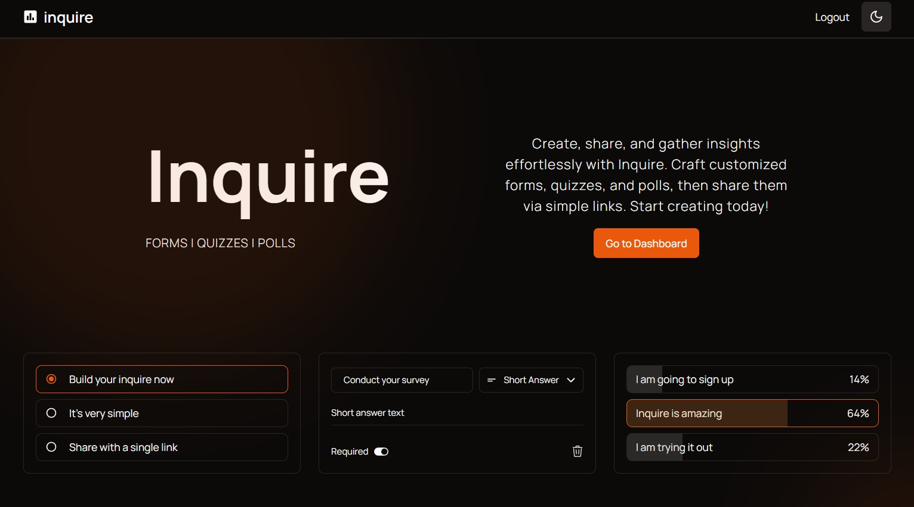

# Inquire

Inquire is a plaform where users can easily create and share forms, quizzes and polls easily with a single link. It is similar to Google Forms. Users can login or sign up easily with a Google or Github account. The creators of the forms or quizzes or polls can view the responses they recieve easily thorugh a reponses page. All your creations can be viewed and managed from a dasbhoard page.

## Table of contents

- [Screenshot](#screenshot)
- [Built with](#built-with)
- [Author](#author)

## Screenshot

Live Site URL:  [Try the app here](https://inquire-alpha.vercel.app/)

## Built with

- Next.js
- Typescript
- TailwindCss
- PostgreSQL
- Prisma
- NextAuth 

## Author

- Github - [mdfarhan20](https://github.com/mdfarhan20)
- LinkedIn - [Mohamed Farhan](https://www.linkedin.com/in/mohamed-farhan-201103cs/)
